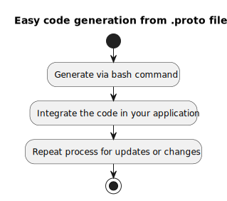

# digi-lab.io | gRPC Build Images Project


Easy-to-use and solution to generate entities and gRPC code from proto files.



This project provides a solid solution to generate gRPC code (client &/ server) from your proto files. It is based on the official [Protocol Buffers Documentation](https://protobuf.dev/) tutorials and provides a simple way to generate code from your proto files.
It will generate entities and [gRPC](https://grpc.io) (client & server) code directly your proto files to any of the available programming languages.

Searching for a GraphQL-like experience? Please check out some of our favorites amazing gRPC user interfaces, also listed on the [Awesome gRPC repo](https://github.com/grpc-ecosystem/awesome-grpc):
   - warthog: https://github.com/forest33/warthog
   - wombat: https://github.com/rogchap/wombat

## Usage

There are mainly two ways to use this project. Either you use the docker images directly or you use the bash alias functions to generate the code.

### dart

This generator is based on the [grpc-dart project](https://github.com/grpc/grpc-dart) and provides a lot of options to generate the code for your needs.
Please check out the [grpc-dart official documentation](https://protobuf.dev/reference/dart/dart-generated/) for more details on all available parameters.

1. Set the function in your bash
    ```bash
    # create a bash alias function for a better overview and easier execution
    # add it to your .bashrc
    grpc-gen-dart() {
        docker run --rm -v $(pwd):/grpc-gen-dart ghcr.io/digi-lab-io/digi-lab-io-grpc-gen-dart:latest protoc "$@"
    }
    ```
2. Call the function by passing your parameters
    ```bash
    grpc-gen-dart -I=your_files/proto your_files/proto/*.proto --dart_out="grpc,generate_kythe_info:./your_files/generated/"
    ```

After this all files will be generated in the `your_files/generated` directory. For a more detailed explanation of the parameters, please check out the [official documentation](https://grpc.io/docs/languages/dart/quickstart/).
Checkout the [grpc-gen-dart-example](grpc-gen-dart/example) for more details on all available parameters.

### python

This generator is based on the [grpcio package](https://pypi.org/project/grpcio/) and provides a lot of options to generate the code for your needs.
Please check out the [protobuf python official documentation](https://protobuf.dev/reference/python/python-generated/) for more details on all available parameters.

1. Set the function in your bash
   ```bash
   # create a bash alias function for a better overview and easier execution
   # add it to your .bashrc
   grpc-gen-python() {
      docker run --rm -v $(pwd):/digi-lab-io/grpc-gen-python ghcr.io/digi-lab-io/digi-lab-io-grpc-gen-python:latest python -m grpc_tools.protoc "$@"
   }
   ```
2. Call the function by passing your parameters
    ```bash
    **grpc-gen-python -I=example/proto \
    	--python_out=./example/python/src/generated/ \
    	--pyi_out=./example/python/src/generated/ \
    	--grpc_python_out=./example/python/src/generated/ example/proto/*.proto**
    ```

After this all files will be generated in the `your_files/generated` directory. For a more detailed explanation of the parameters, please check out the [official documentation](https://grpc.io/docs/languages/dart/quickstart/).
Checkout the [grpc-gen-python-example](grpc-gen-python/example) for a working example.

### typescript 

This generator is based on the very solid and flexible [ts-proto project](https://github.com/stephenh/ts-proto) and provides a lot of options to generate the code for your needs.
Please check out their project, for more details on all available parameters.

1. Set the function in your bash
   ```bash
   # create a bash alias function for a better overview and easier execution
   # add it to your .bashrc
   grpc-gen-ts() {
      docker run --rm -v $(pwd):/digi-lab-io/grpc-gen-ts ghcr.io/digi-lab-io/digi-lab-io-grpc-gen-ts:latest protoc "$@"
   }
   ```
2. Call the function by passing your parameters, in this case for a nestjs project
    ```bash
    grpc-gen-ts -I=example/proto \
    	--ts_proto_opt=addGrpcMetadata=true \
    	--ts_proto_opt=returnObservable=true \
    	--ts_proto_opt=nestJs=true \
    	--ts_proto_out=./example/ts/src/generated/ \
    	--ts_proto_opt=addNestjsRestParameter=true \
    	example/proto/*.proto \
    	google/protobuf/timestamp.proto
    ```
After this all files will be generated in the `your_files/generated` directory. For a more detailed explanation of the parameters, please check out the [official documentation](https://grpc.io/docs/languages/dart/quickstart/).
Checkout the [grpc-gen-ts-example](grpc-gen-ts/example) for a working example.

## Contributions

Contributions are welcome and we need help!
This project is still in its early stages, and we need your help to make it better. Our goal is to provide an easy-to-use and solid solution to generate gRPC code from your proto files.
Feel free to open issues or pull requests if you have any suggestions or ideas.

## License

This project is licensed under the MIT License. See the [LICENSE](LICENSE) file for details.
